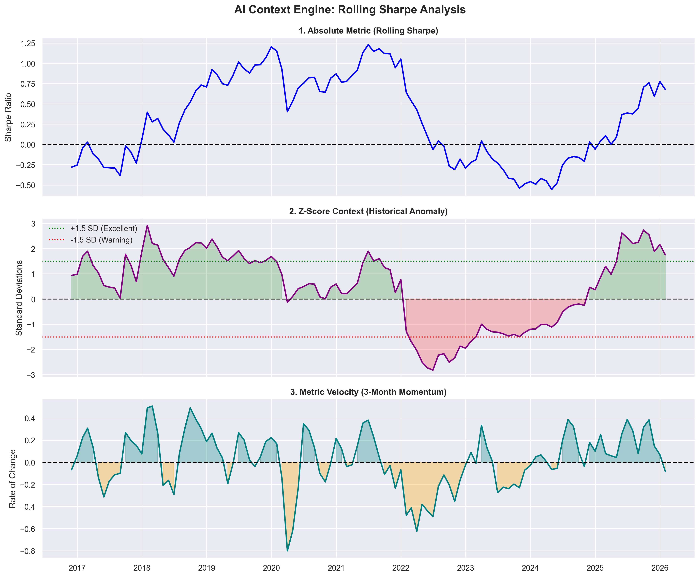

# Quantitative Diagnostic Report
**Date:** 2026-03-24
**Asset/Portfolio:** Regime 2 (Core-Satellite Foundation)

---

## 1. Executive Summary (KPIs)
| Metric | Value |
| :--- | :--- |
| **CAGR** | 10.44% |
| **Volatility** | 10.11% |
| **Sharpe Ratio** | 0.11 |
| **Max Drawdown** | -22.34% |

---

## 2. Macroeconomic Context (Macro Agent)
O cenário macroeconómico atual é caracterizado por uma tendência desinflacionária em curso, embora em desaceleração, com a inflação global a moderar enquanto os componentes dos serviços subjacentes se mostram mais persistentes, desafiando os esforços dos bancos centrais na "última milha". Consequentemente, as taxas de juro globais permanecem em níveis restritivos, com o ciclo de subida largamente concluído, mas o *timing* e a magnitude dos potenciais cortes futuros estão sujeitos a um debate significativo no mercado e à dependência de dados, influenciando a dinâmica da curva de rendimentos. Neste contexto, o apetite pelo risco oscila entre o otimismo impulsionado pela resiliência económica percebida e a perspetiva de eventual flexibilização monetária, e a cautela decorrente de riscos geopolíticos persistentes, níveis de dívida elevados e o potencial de uma desaceleração do crescimento.

---

## 3. Autonomous Agent Analysis (Quant Agent)
**Relatório Diagnóstico do Portfólio (31/01/2026)**

O portfólio demonstra um desempenho de risco-retorno excepcionalmente forte, com um Sharpe Ratio Contínuo de 0.6778. Seu Z-Score de 1.7605 indica uma performance significativamente superior à sua média histórica de 36 meses, classificando-se como excelente. Contudo, a velocidade de -0.0826 nos últimos três meses sugere uma desaceleração recente nesta tendência positiva. Em termos de risco, a Volatilidade Contínua é de 0.1136, com um Z-Score de -1.0487, o que a posiciona ligeiramente abaixo da média histórica, sem atingir níveis extremos. A velocidade de -0.0031 nos últimos três meses aponta para uma marginal redução adicional da volatilidade.

A gestão de risco de cauda é notavelmente eficaz, conforme evidenciado pelo Max Drawdown Contínuo de -0.1568. O Z-Score de 3.0895 para esta métrica é excepcional, indicando que a magnitude da perda máxima é consideravelmente menos severa do que a média histórica do portfólio nos últimos 36 meses. Isso reflete uma proteção robusta contra quedas significativas. A velocidade de 0.0132 nos últimos três meses reforça essa tendência positiva, mostrando uma melhoria contínua na resiliência do portfólio a perdas.

---

## 4. Mathematical Context Dashboard


---

## 5. Technical Audit Annex (JSON Payload)
The raw data below was processed by the LLM to generate the analysis.

```json
{
    "portfolio_ticker": "Portfolio",
    "analysis_date": "2026-01-31",
    "lookback_window_months": 36,
    "metrics": {
        "Rolling_Sharpe": {
            "absolute_value": 0.6778,
            "z_score": 1.7605,
            "velocity_3m": -0.0826
        },
        "Rolling_Volatility": {
            "absolute_value": 0.1136,
            "z_score": -1.0487,
            "velocity_3m": -0.0031
        },
        "Rolling_Max_Drawdown": {
            "absolute_value": -0.1568,
            "z_score": 3.0895,
            "velocity_3m": 0.0132
        }
    }
}
```
